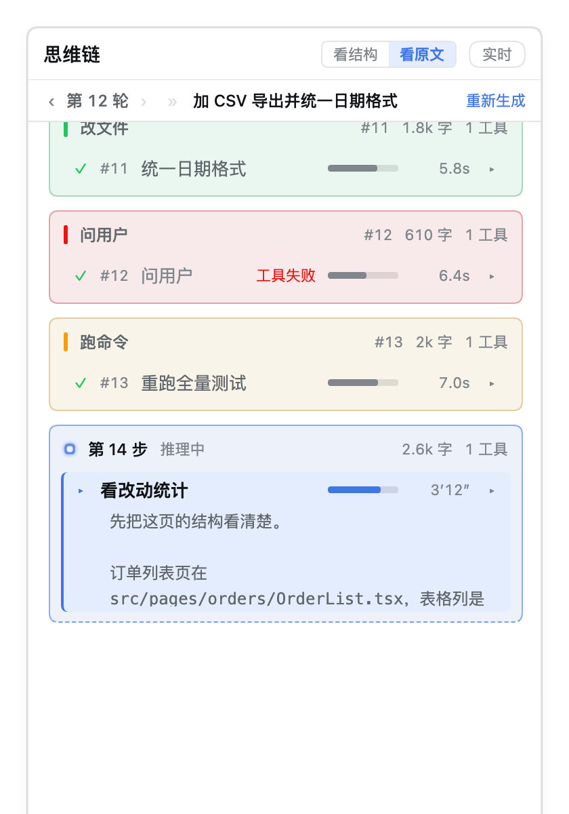
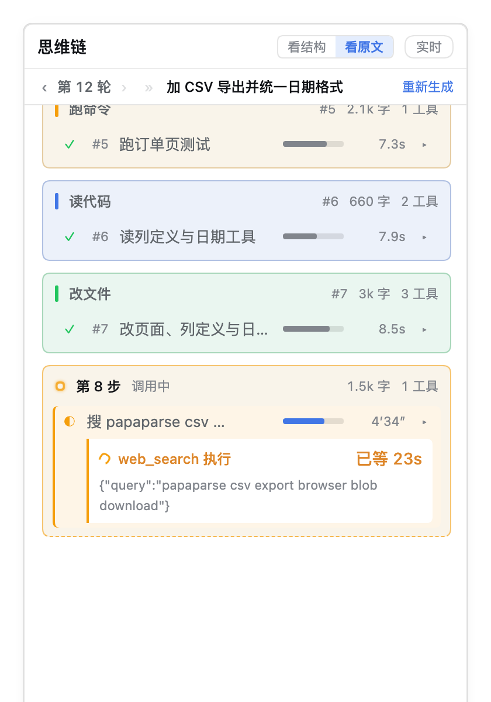
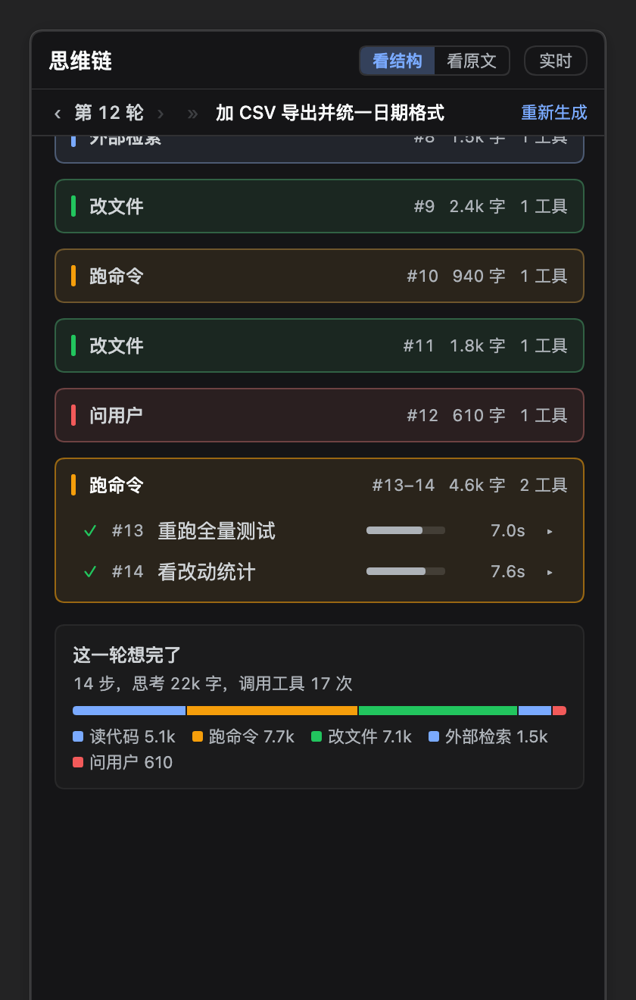
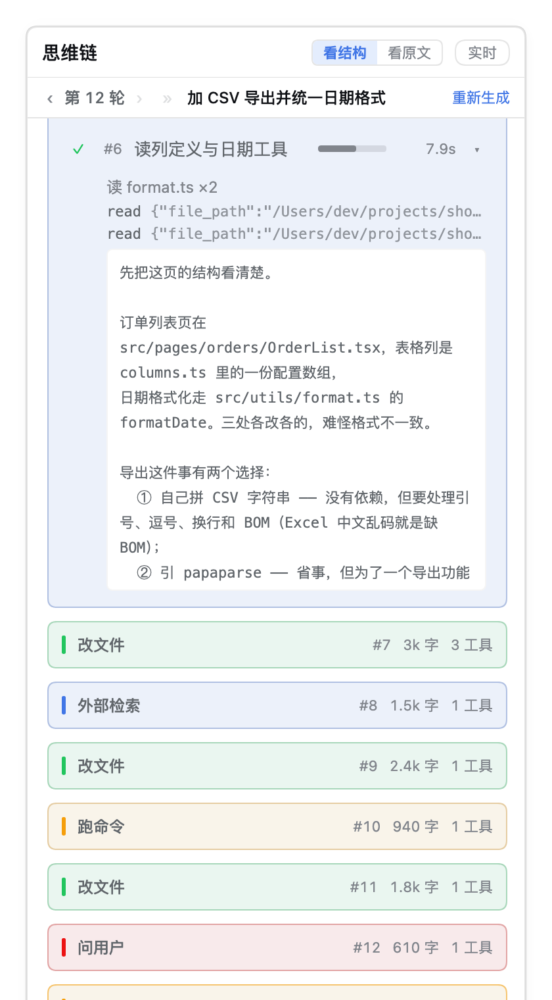
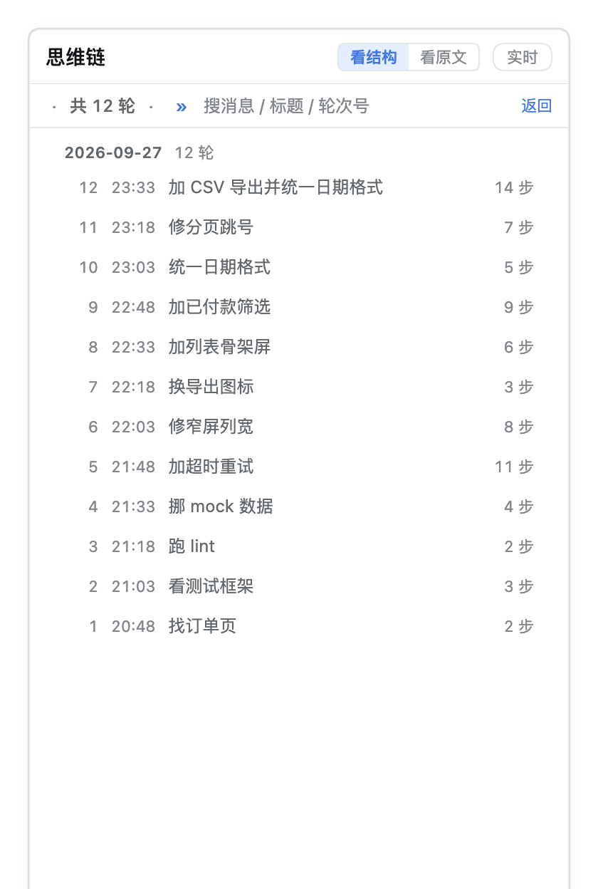
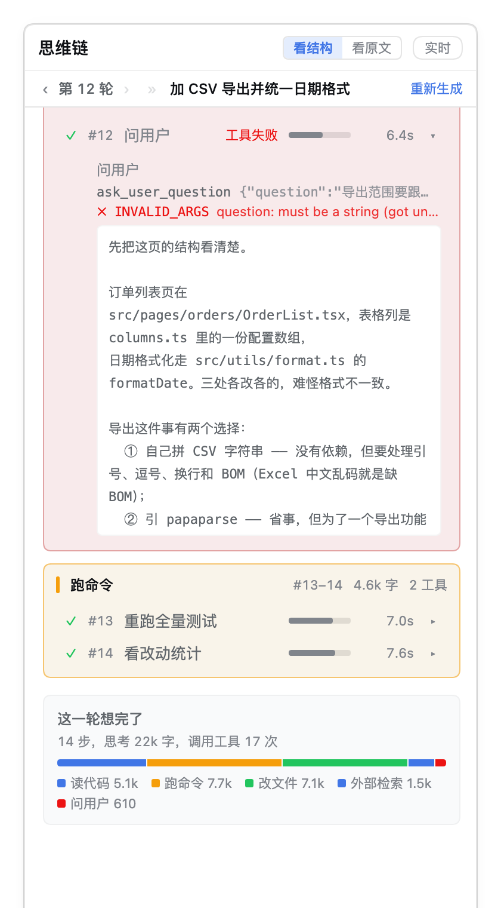

# dsh-think-flow · 思维链可视化

> 在 [DSH](https://github.com/deepseek-ai) Web 的**右侧栏**开一个「**思维链**」标签页，
> 把模型的实时思考按 **`turn → step →（思考原文 + 工具调用）`** 聚合成能读的结构：
> 每一步在干嘛、调了什么工具、它在读哪个文件、**哪一段正在等外部接口**。

[](https://github.com/yfwu2020/dsh-think-flow/releases)
[](https://www.npmjs.com/package/@yfwu2020/dsh-think-flow)
[](./package.json)
[](./scripts)
[](https://github.com/yfwu2020/dsh-think-flow)

---

## 它解决什么问题

**DSH 的主对话界面不显示思维链。** 而模型的思考恰恰是最值得看的东西：
它决定得对不对、有没有绕路、卡在哪一步。

但**直接把思考流倒出来是没法读的**。这是真实会话里量出来的一个 turn：

| | 实测 |
| --- | --- |
| 一个 turn 的步数 | **53** |
| 一个 turn 的时长 | **1550 秒**（约 26 分钟） |
| 一个 turn 的思考量 | **7.1 万字** |
| 一个 turn 的工具调用 | **68 次** |

所以这个面板做了四件事，每一件都对应上面某个数字：

- **按 step 聚合，不逐字渲染**。reasoning 每秒几百个事件，逐事件重绘会把面板刷成幻灯片。
  宿主侧按 step 折叠 + **120ms 合并推送**（`sseThrottleMs`）。
- **分层折叠**。53 步全展开要滚几十屏；把"同一类活动"合并成阶段块。默认只展开最新一轮，
  那一轮里只展开**当前所在阶段**；更早的轮次收成一行，点开才看。
  例外：**实时看过的那一轮不自动收** —— 生成中收起来会把前面那些组缩成一行标题，
  生成完再收又会把读到一半的位置顶掉；要收手动点组头。
- **显式画出「在等工具」**。实测两步之间能有 **47 秒**模型零输出（联网检索中）——
  不画出来，界面在这 47 秒里与卡死无法区分。
- **轮次可回溯**。正文只常驻最近 20 轮，更早的走**全轮目录**按需折回来；
  翻到 100 轮之前也不用把它全塞进内存。

## 长什么样

<table>
<tr>
<td></td>
<td></td>
</tr>
<tr>
<td align="center"><b>① 正在思考</b><br>当前步整块高亮、呼吸环 + 秒表实时涨；<br>每行右侧容量条 = 那一步的思考字数</td>
<td align="center"><b>② 正在等工具</b><br>唯一的高亮块：<code>web_search 执行 · 已等 23s</code><br>把"在等外部接口"和"卡死"分开</td>
</tr>
</table>



本轮结束后补一块**「这一轮想完了」**：多少步、思考多少字、调了多少次工具，以及
**思考花在哪了**（读代码 / 跑命令 / 改文件 / 外部检索 / 问用户的比例）。
分布用同一色相只变深浅，不给每个阶段编一个颜色。

<table>
<tr>
<td></td>
<td></td>
</tr>
<tr>
<td align="center"><b>③ 展开某一步</b><br>模型标题 → 次级标题（按工具参数算的派生标题）<br>→ 工具详情 → 按需取回的思考原文</td>
<td align="center"><b>④ 全轮目录</b><br>第二行标题<b>双击</b>就地变搜索框；<br>12 轮、100 轮都在这儿翻，搜索全在本地算</td>
</tr>
</table>



**工具失败**照宿主的判定显示（`isError` + `error.code`）：行里一枚红标，
**为什么**失败在展开区紧跟它自己那条工具行（上图 `✗ INVALID_ARGS …`）。
红只给错误文本，工具名不动 —— 失败的是这次调用，不是这个工具。

> 上面这些图**不是另画的示意图**：由 `npm run shots` 用构建产物里**真正的组件**渲染、
> 配宿主主题包里整段抓出来的真 token、headless Chrome 拍下来，宽度就是右侧栏真实的 **380px**。
> 数据来自 `scripts/demo-data.mjs`，是**合成的**一段会话。

## 安装

```bash
# 从 npm（推荐）
dsh plugin --profile web add @yfwu2020/dsh-think-flow

# 或从 GitHub Release 的 tgz（同一个产物，不走 npm）
dsh plugin --profile web add /path/to/yfwu2020-dsh-think-flow-0.1.0.tgz

# 或从本地目录（开发用：改完不用重装，只重建）
dsh plugin --profile web add link:/path/to/dsh-think-flow
```

装完在 DSH 里落成三处：

| 位置 | 内容 |
| --- | --- |
| `~/.dsh/profiles/web/package.json` | `"@yfwu2020/dsh-think-flow": "<版本或 link:路径>"` |
| `~/.dsh/profiles/web/node_modules/@yfwu2020/dsh-think-flow` | 软链 → 插件目录 |
| profile 的 `dsh.profile.bundles` | 包名（**按包名引用，与路径无关**） |

打开方式有两个：**会话头部那个折线图标**，或者右侧栏标签条上的「思维链」。

> ⚠️ **装完要重建进程**：host 半是新的 bundle，需要重启 `dsh web`，之后硬刷新浏览器
> （Cmd/Ctrl+Shift+R）。此后只改 client 半的改动会被 `client-hmr` 就地替换，不用刷新。

**要求**：DSH 运行时 **`>=0.1.7-rc`**（见 `package.json` 的 `peerDependencies`）。
0.1.7-rc 起 `createSystemMessage` 去掉了插件署名参数；更旧的运行时上行为不一致。

> ⚠️ npm 上 `@deepseek-ai/*` 这些包的 `latest` 还停在更旧的 `0.0.1-rc.x`，缺 `WebServer`
> 等 API —— 从源码构建时按 `package.json` 里钉的版本装，别用 `latest`。

## 配置项

改 profile 的 `cordis.patch.yml` 里 `id: think-flow` 那一行的 `config:`（**覆盖**，不要再 insert）：

```yaml
- id: think-flow
  config:
    maxTurnsPerSession: 20
```

| 键 | 默认 | 范围 | 含义 |
| --- | --- | --- | --- |
| `maxTurnsPerSession` | `20` | 0–500 | 每个会话常驻多少轮的**正文**（0 = 不限）。⚠️ 这是正文窗口，不是"能看到多少轮" |
| `maxIndexTurns` | `2000` | 0–20000 | **目录**（全轮骨架）最多记多少轮。一轮骨架几百字节，所以给得宽 |
| `coldTtlMs` | `7200000` | 0–86400000 | 按需折进来的**冷轮正文**保留多久（空闲计时：读一次续一次期。0 = 不按时间收） |
| `maxColdChars` | `4000000` | 0–2e8 | 冷轮正文的**硬上限**。和 `coldTtlMs` 是两条独立策略，**谁先到算谁** |
| `maxReasoningCharsPerStep` | `120000` | 1000–400000 | 单个 step 的思考原文上限，超了从**尾部**保留并打上"这段不全" |
| `maxSessions` | `32` | 1–256 | 内存里同时跟踪多少个会话（LRU） |
| `sseThrottleMs` | `120` | 0–2000 | 合并推送的最小间隔。**别调到 0**：流式每秒几百个事件 |
| `heartbeatMs` | `15000` | 2000–120000 | SSE 心跳，防代理掐连接 |
| `snapshotTailChars` | `4000` | 200–20000 | 连接快照里给"当前步"带多少字符原文（其余步骤走 `/step` 按需取） |
| `titleStepChars` | `420` | 80–4000 | 生成中文标题时，每一步最多喂多少字思考原文 |
| `titleTotalChars` | `24000` | 2000–200000 | 一次标题请求的字符上限（整轮一起总结，**一次调用**） |
| `titleReasoningEffort` | `'low'` | — | 生成标题的推理档位（压缩任务，低档就够） |
| `titleCachePath` | `''` | — | 标题缓存路径。空 = `~/.dsh/think-flow/titles.json` |
| `autoTickMs` | `5000` | 20–60000 | 自动标题（面板上的「实时」）的节拍器间隔 |
| `maxHydrateEvents` | `20000` | 0–200000 | 历史回看时最多折入多少条落盘事件（从最新往回取） |
| `maxTitledTurns` | `640` | 0–10000 | 标题缓存最多保留多少轮 |

**三条策略要一起看**（它们管的是同一块内存）：

```
turns（正文）        maxTurnsPerSession = 20   ← 常驻
  └ 更早的轮次按需折进来 = 冷轮正文
       ├ coldTtlMs    = 7,200,000   空闲 2 小时收回
       └ maxColdChars = 4,000,000   字符超了从最旧的丢
index（全轮骨架）    maxIndexTurns = 2000      ← 目录读它；正文丢了它还在
```

时间策略管"不用了就还回来"，但它**没有内存上界**（两小时里连开几百个老轮次会一直涨），
字符上限补的正是那个洞 —— 所以两条都建议留着。

**清理全是自动的，没有手动入口**（要手动只能删文件或重启进程）。除上面那些，
还有两处硬编码上限：`trace.attempts` 是 128 条 FIFO；订阅者的增量队列由节流窗口清空。
另外**卸载插件不会删** `~/.dsh/think-flow/`（标题缓存留着，重装即复用）。

## 面板怎么用

| 想干的事 | 怎么做 |
| --- | --- |
| 看结构 / 看原文 | 头部 `看结构 \| 看原文` 切换。**实时默认「看原文」**，切过去就展开本轮 |
| 展开某一步 | 点行尾的 `▸`。展开区依次是：次级标题（派生标题）、工具详情、思考原文（以及回答正文） |
| 看某一步在等什么 | 悬停那一步 —— 悬停里给全工具体、机读码、失败原因 |
| 回到更早的轮次 | **双击第二行标题**进目录；或点轮号两侧的 `‹ ›` 走相邻轮 |
| 找某一轮 | 目录里那个搜索框：搜**用户原话 + 轮次标题 + 轮号**，**全在本地算，零请求** |
| 给整轮起个中文标题 | 点第二行右侧的「生成标题」（整轮一次模型调用，结果落盘缓存；再点走缓存） |
| 每轮自动起标题 | 头部「实时」开关（**默认关**，开着才按 `autoTickMs` 节拍自动生成） |

几个不显眼但有用的：

- **容量条**（每行那根灰条）宽度 = 该步思考字数。谁想得多一眼看得出来，不用印数字。
- **状态字形**：`✓` 完成 · `▸` 进行中 · `◐` 等工具 · `■` 被中断。
- **派生标题**：模型标题的**替补**。没生成标题时，行里显示的是按**工具参数**算出来的短标题
  （`读 client.js`、`跑构建`、`改 index.js ×3`）—— 所以任何时刻都看得出"这一步机械地做了什么"。
  相邻的同类调用会合并成 `×N`，杀掉重复又保住"调了几次"。
- **命令自带的英文说明会翻成中文**贴在派生标题后面（`跑构建 · 跑构建确认没回归`）。
  说明在 `tool/call` 那一刻采集 —— 参数会被截断，那是唯一能保住它的时机。
- **底部留白 150px**：让最后一个内容还能往上滑一点，不然贴底那行永远被挡着。

### 会话四态

会话读不到和"还没开始"是两件事，面板分开说（状态随快照下发）：

| 状态 | 面板上 | 什么时候 |
| --- | --- | --- |
| `live` | 正常面板 | 收到了实时事件 |
| `hydrated` | 正常面板 | 从落盘日志折出来的历史 |
| `empty` | "这个会话还没有开始推理" | 刚开的会话，一个 step 都没有 |
| `unreadable` | "读不到这个会话的思考记录" + 可能原因 | 会话被删 / 被别的进程占用 |

有实时事件进来时 `unreadable` 会回到 `live`，不会一直挂着。

### 历史回看是怎么做的

事件是**实时**的、不回放，所以插件加载之前、以及更早的会话，内存里什么都没有。
现在打开面板时**先补历史**：`/trace`、`/stream`、`/titles` 三条路都会先 `hydrate()` ——
但**只在该会话内存里还没有任何 turn 时**做，绝不覆盖实时状态；读盘失败（会话不存在 /
被别的进程锁住）静默降级，实时数据照常返回。

一个关键差别：**落盘的是组装结果，不是流帧**。实时路径收到的是 `reasoning-delta` 增量，
历史路径读的是 `assistant/message` 里组装好的整块 —— 后者**覆盖**前者。覆盖是刻意的：
同一步重试会有多条 `assistant/message`，以最终那条为准更正确，顺带把流式缺口也补上了。

## 接口

宿主半注册在 `/think-flow/api/*` 下（`curl -s localhost:3080/think-flow/api/ping` 可自检）：

| 路由 | 用途 |
| --- | --- |
| `GET /stream?session=<id>` | **SSE**：先发一份快照，之后只发增量 |
| `GET /trace?session=<id>` | 一次性快照（JSON） |
| `GET /step?session&turn&step` | 按需取某一步的**完整**思考原文 |
| `POST /titles?session&turn[&force=1]` | 生成某一轮的中文标题（**只补缺的**；`force=1` 整轮重算）。用 POST 是因为它会**产生模型调用**，不该被当成可缓存的 GET |
| `POST /auto?session&on=1\|0` | 开关**自动标题**（默认关）。状态记在宿主侧，随快照回给面板 |
| `GET /sessions` | 当前在跟踪哪些会话（轮数/步数/订阅者数） |
| `GET /ping` | 诊断：`build` 号、帧/事件计数、缺口数、淘汰计数 |

**快照刻意只带"当前步"的原文**：一个 turn 实测 7 万字，53 步全带原文每次连接要传几 MB。
其余步骤只给字数与状态，展开时走 `/step`，之后走缓存。

## 它是怎么工作的

```
┌─ 宿主半  src/index.ts + src/trace.ts + src/titles.ts ─────────────────┐
│                                                                       │
│  ctx.on('agent/assistant-stream')  ─┐                                 │
│  ctx.on('session/event')           ─┴→ 折成 turn → step →（思考+工具） │
│                                        每个会话一份，LRU 上限 32       │
│                                              │                        │
│                        ┌─────────────────────┼─────────────────────┐  │
│                        ▼                     ▼                     ▼  │
│                 /stream（SSE）         /trace（快照）       /step（按需）│
│                 120ms 合并推送          连接时发一次        展开时才取   │
└───────────────────────────────────────────────────────────────────────┘
                                 │
┌─ 客户端半  src/client/index.js ─┴─────────────────────────────────────┐
│  右侧栏标签页（真组件）；样式**全部**来自宿主 --dsw-* token，深浅自动跟随 │
└───────────────────────────────────────────────────────────────────────┘
```

几个刻意的取舍：

- **折在宿主，不在浏览器**。事件是「流式增量 + 步边界 + 工具调用」三路混在一起，
  在浏览器里折等于把同样的活干三遍，而且面板一刷新就得重来。
- **状态只有一个来源**。`stepStatus()` 是纯函数，面板照抄宿主下发的状态，自己不推导 ——
  早先两边各推一次，结果是"每一步跑完仍显示正在生成"。
- **中文标题按需生成**。只有你点「生成标题」时才调用模型（或打开「实时」），
  一次调用覆盖整轮，结果按**内容指纹**落盘缓存：内容变了指纹才变，不会拿到旧标题。
- **正文可丢，骨架不丢**。目录靠每轮几百字节的骨架（轮号/时间/用户消息/步数/字数），
  所以 133 轮的会话也能在面板里翻完，而正文只留你真正在看的那几轮。
- **样式只用宿主 token**（`--dsw-*`），一个硬编码色值都没有 —— 所以深浅色自动跟随，
  也不会在宿主换肤后和界面其余部分不是一套语言。

### 阶段块是怎么切的

同族（`read`/`grep`/`glob` 都算"读代码"，`edit`/`write` 算"改文件"…）**且相邻**、
**间隔 < 90 秒**的步骤合并成一个块。90 秒这个阈值是量出来的：夹在两次 `grep` 之间的
一个 `npm test` 用 20 秒阈值会把列表切成 9 个碎块，90 秒就不切。

命令行**再按命令内容细分**：只读命令（`sed`/`grep`/`cat`/`ls`）算「读代码」，
有副作用的（跑测试/构建/提交）算「跑命令」—— 实测一个会话 89 条命令里 70% 是前者，
28% 是后者，混在一起叫什么都不对。

### 为什么本地规则做不出中文标题

试过用规则从工具参数起标题（现在仍是**派生标题**那条路，用来兜底），但它只能回答
"这一步机械地做了什么"，回答不了"这一步在解决什么问题"。实测拿它当主标题，
一轮 40 步里有 26 步长得一模一样（都是 `跑测试`）。所以主标题交给模型
（一次调用、整轮一起总结、按内容指纹缓存），规则退回去做**次级标题**。

### 工具失败是宿主说了算

判据**全部来自宿主的会话事件**，面板一个都不猜：

| 事实 | 来源 |
| --- | --- |
| 这次调用失没失败 | `message.isError === true`（严格判等，脏数据里的字符串 `'true'` 不算） |
| 机读错误码 / 类名 | `error` 的 `{ name, code }`（实测 104 条失败里 7 条没有 → 只印那句话） |
| 给人读的那句话 | `message.content[].text`，去掉 `Error: ` 前缀；读不出就只留红标，**不编内容** |

实测失败率 **0.9%**（8 个会话 11283 次调用里 104 次），所以红标是有效信号，
不至于把面板染红。⚠️ 但别拿它当"退出码非零"：`bash` 的非零退出**不算失败**
（退出码是结果数据，只在正文尾部标 `[exit code: N]`）。

## 数据与隐私

这个插件读**你的会话**，所以边界写清楚：

| | |
| --- | --- |
| **会写盘的东西** | 只有一个**标题缓存**：`~/.dsh/think-flow/titles.json`（派生物，删了随时能重算；上限 `maxTitledTurns` 轮）。文件坏了会**静默从空缓存开始**并覆盖原文件（无备份）—— 丢了能重算，所以可以接受 |
| **会话数据** | **只读**。会话日志由宿主写，插件只读不写；内存里折出来的轨迹按 LRU 回收 |
| **什么时候联网** | 只有「生成标题」/「实时」这一条路会调用模型（走宿主自己的 `llm` 服务与凭据）。除此之外一个外部请求都没有 |
| **遥测** | 没有。不上报任何东西 |
| **`/ping`、`/sessions`** | 只报计数与 build 号，不含会话内容 |

开发仓库里另有一层约定：**真实会话渲染出来的开发资料不进公开仓库、也不进 npm 包**
（`.gitignore` / `.npmignore` 里单列一段），公开的预览页与截图一律用
`scripts/demo-data.mjs` 里**合成**的数据。

## 开发

```bash
npm install                # devDependencies 里钉了构建所需的那几个 @deepseek-ai/*

npm run build              # tsc 编译 host 半 + 拷贝 client 半 → lib/
npm test                   # 模板反引号 + typecheck + 1124 条断言（全部离线）
npm run preview            # 生成 docs/ui-preview.html（真组件 + 真主题 token，合成数据）
npm run shots              # 重新生成 assets/*.png（README 那几张图）
npm run align              # 布局对齐检查（真浏览器量 getBoundingClientRect，需先 preview）
```

单独跑某一套：

```bash
npm run test:trace     # 146 条：纯函数折叠（含工具失败、截断、步边界）
npm run test:titles    #  45 条：提示词预算、响应解析容错、缓存指纹
npm run test:routes    # 156 条：SSE 分帧、快照形状、按需取原文、LRU、节流、心跳、缓存
npm run test:client    # 777 条：注册、渲染、交互、历史、目录、对比度（解析真 token 算）
```

| 路径 | |
| --- | --- |
| `src/index.ts` | 宿主：订阅事件、路由、标题生成与缓存、历史回看 |
| `src/trace.ts` | 折叠逻辑（**纯函数**，可单测） |
| `src/titles.ts` | 标题提示词、预算、响应解析、内容指纹 |
| `src/client/index.js` | 右侧栏标签页（手写的 ModuleLoader bundle，**没有 JSX / 打包器**） |
| `scripts/demo-data.mjs` | **合成**演示会话（预览页与截图共用） |
| `scripts/demo-scenes.mjs` | 演示场景定义（预览页与截图共用同一份，图不会和实物不一致） |
| `scripts/preview-harness.mjs` | 跑构建产物里真组件的底座 + 宿主主题 token 提取 |
| `scripts/gen-readme-shots.mjs` | 出 README 截图（headless Chrome，2× 出图） |

**怎么确认改动生效了**：`curl -s localhost:3080/think-flow/api/ping` 看 `build` 号 ——
改宿主代码后 +1。**host 半要重启 `dsh web`**（热重载只重建 fiber，不重新 import 模块，
ESM 缓存里还是旧代码）；**client 半刷新页面即可**。

## 边界与已知限制

- **正文窗口默认 20 轮**：更早的走目录按需折回来（有缓存与上限），不是"看不到"。
- **历史回看最多折 `maxHydrateEvents` 条事件**：上万事件的长会话，更早的轮次可能折不完整。
- **标题是模型的产物**：偶尔会把某一步起得很泛（"处理文件"）；这时展开区的**次级标题**
  （本地规则算的）仍在，机械事实不会丢。
- **面板一次只显示一轮**：这是刻意的 —— 一轮 53 步，两轮并排就没法读了，所以用目录翻。
- **没有 TTL 也没有定时任务**：内存只有容量上限；标题缓存文件坏掉会静默重置。
- 需要 **web** profile（右侧栏 + webserver）；TUI 下没有这个面板。

## 许可

[MIT](./LICENSE) © 2026 yfwu2020
